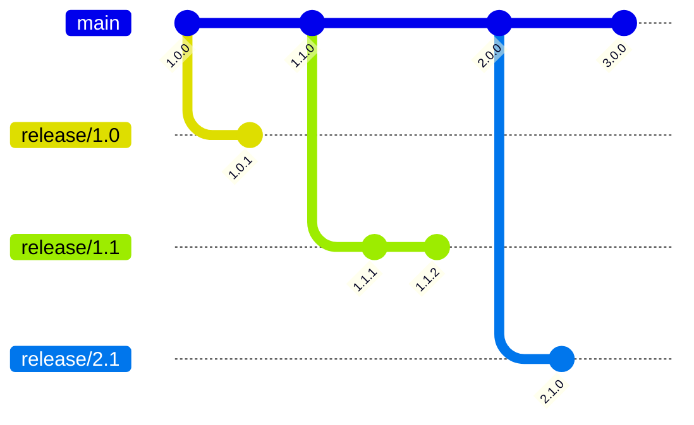

# Multi-Version Release Workflow Example

This guide demonstrates:

- Supporting **N-1 versions** (latest and previous minor)
- Bug fixes, maintenance releases, and breaking changes
- Cherry-picking fixes to multiple versions

---

## 0️⃣ Prerequisites

> **Note:** This demo skips proper pull request creation for simplicity. In a real workflow, each feature or bug fix should ideally go through a PR for review.

Before following this workflow, make sure you have a fresh copy of the repository ready for GitHub:

1. **Clone the original repository** locally:

   ```bash
   git clone git@github.com:michalschott/semantic-release-demo.git my-repo
   cd my-repo

2. **Remove the existing Git history:**
   ```bash
   rm -rf .git
   ```

3. **Create a new repository on GitHub (via the web interface or CLI).**

4. **Add the new Git remote:**

   ```bash
   git remote add origin <new-repo-url>
   ```

After completing these steps, your repository is ready to follow the multi-version release workflow.

This ensures readers start with a clean repo, preventing any history or branch conflicts.

## 1️⃣ Initial Release (1.0.0)

```bash
git push
```

## 2️⃣ Next Feature Release (1.1.0) — Add o11y Chart

```bash
git checkout main
mkdir o11y
touch o11y/Chart.yaml
git add -A
git commit -am "feat: added o11y chart"
git push
```

Fetch tags once workflow has finished:

```bash
git fetch
```

## 3️⃣ Bug Fix for 1.0 and 1.1

**Step 1 — Create 1.0 maintenance branch and fix bug:**

```
git checkout -b release/1.0 1.0.0
echo "fixed" > github-runnerset/templates/job.yaml
git commit -am "fix: job fix"
git push
export COMMIT=$(git rev-parse HEAD)
```

**Step 2 — Apply fix to main (1.1):**

```bash
git checkout main
git cherry-pick $COMMIT
git push
```

* Releases: **1.0.1** and **1.1.1**

## 4️⃣ Supported Versions

After the fix:
* **1.0.1**
* **1.1.1**

## 5️⃣ Breaking Change Release (2.0.0)

Bump Ingress NGINX to 4.13.1 (backwards-incompatible):

```bash
git checkout main
echo "version: 4.13.1" > ingress/Chart.yaml
git commit -am 'feat: ingress 4.13.1

BREAKING CHANGE: ingress version'
git push
```

* Drops support for **1.0**
* Supported versions: **1.1** and **2.0**

## 6️⃣ Security Patch for 1.1

```bash
git checkout -b release/1.1 1.1.1
echo "version: 4.12.7" > ingress/Chart.yaml
git commit -am "fix: ingress 4.12.7"
git push
git fetch
```

* Releases: **1.1.2**
* Now we have **2.0.0** and **1.1.2**

## 7️⃣ Preparing 3.0.0 and 2.1.0

* **3.0.0:** Backwards-incompatible github-runnerset change
* **2.1.0:** Add Istio support

**Step 1 — Add breaking change:**

```
git checkout main
echo "breaking change" > github-runnerset/templates/job.yaml
git commit -am 'feat: breaking change to job

BREAKING CHANGE: I break change something'
git push
```

**Step 2 — Add Istio feature to 2.1.x and 3.0.x:**
```bash
git checkout -b release/2.1 2.0.0
mkdir istio
touch istio/Chart.yaml
git add -A
git commit -am "feat: added istio"
git push
export COMMIT=$(git rev-parse HEAD)
```

```bash
git checkout main
git cherry-pick $COMMIT
git push
```

## 8️⃣ Summary of Supported Versions
* Active fixes: **3.0**, **2.1**
* Older releases either dropped or maintained as needed
* Main branch is ready for **4.0.0** development

## 9️⃣ Version/Branch Diagram



* **Cherry-picks are represented by commits on release branches**

  Each maintenance branch (e.g., release/1.1) contains commits that were cherry-picked from main to fix bugs or backport features.

* **Breaking changes trigger major releases on main**

  Any commit with a BREAKING CHANGE in the message creates a new major version on the main branch, automatically bumping the version according to semantic versioning.

* **Bug fixes are applied via release branches**

  Fixes for previous versions are committed to the corresponding release/* branch, then optionally cherry-picked to later versions on main to ensure all supported versions get the fix.

## ✅ This workflow demonstrates:

* Maintenance releases for multiple minor versions
* Bug fixes applied via cherry-picks
* Breaking changes triggering major releases
* Clear version isolation using release/* branches
